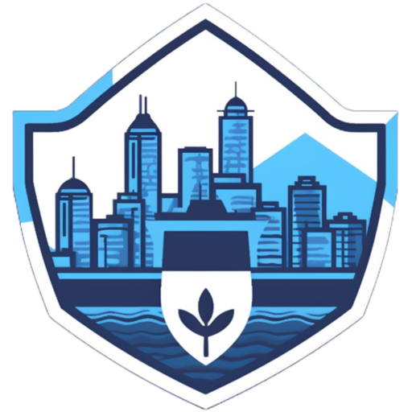

 

  
  

  <h1 align="center">GuardNav</h1>
  <h3 align="center">Plan a safe trip in Vancouver</h3>

### Overview:
GuardNav aims to provide users with a reliable and user-friendly navigation experience, prioritizing their safety by leveraging historic crime information. With features like safe route planning, data visualization through heat maps, the app empowers users to make informed decisions while navigating Vancouver and ensures their confidence in reaching their destinations securely.

>

### Target Users
The Safe Route Planning App is intended for the following user groups:

1. Commuters who prioritize reaching their destination safely.
2. Tourists who want to explore the best of Vancouver while avoiding high-risk areas.
3. Parents who seek to ensure the safety of their children while traveling around the city.
4. Delivery or rideshare companies (e.g., Uber, Doordash) aiming to take the safest and most efficient routes for optimal customer service.
5. Prospective real estate investors who desire information on the safety of specific areas.

>

### Key Features
**Safe Route Planning:** Utilizes historic crime data to create safe routes, enabling users to avoid high-risk areas and navigate securely.

**Data Storage:** Stores relevant data, including user-selected routes and imported data in CSV format.

**Visualization of Safety:** Provides users with a visual representation of danger levels through heat maps, helping them assess the safety of different areas.

## Project Task Requirements
> Please note that the following requirements are subject to change and may be modified during the course of development:

**Minimal**
>will definitely complete
- [x] Create a simple CRUD (Create, Read, Update, Delete) functionality to enable users to manage trips.
- [x] Users should be able to add trips by specifying a pair of source and destination locations.
- [x] Each trip should include the suggested routes, the primary route selected by the user.
- [x] Users should be able to update the origin or destination of the primary route, similar to the timeline functionality in Google Maps.
- [x] Utilize historic crime data to create the initial dataset for generating a heatmap.
- [x] The heatmap should display risk levels across Vancouver based on the crime data.
- [x] Develop a basic user interface (UI) that includes a map displaying the generated heatmap.

**Standard**
>will most likely complete
- [x] Integrate route planning that avoids high risk areas.
- [x] Multiple route suggestions with varying levels of risk.
- [x] Risk categorization. [intensity weighted]

**Stretch Goals**
>will complete if time permits
- [ ] Implement a grid representation to validate hazard reports.
- [ ] Use aggregated number of reports in the area for the validation
- [x] User authentication and user profiles.
- [ ] User preferences for risk levels and categories.
- [ ] Alert system if off-route.
- [ ] CRUD to enable users to add, update, and delete their own reports of hazards and risks to be added to the database.
- [ ] Enhance manual crime entry functionality with entry validation.
- [ ] Real-time alerts of new hazards along the route.
- [x] Send directions to user via SMS.
- [ ] friendly design for mobile users

## Prototypes:

### Landing Page

### Main Page

### Map Page

## Utilizes tech from Units 1-5

#### Unit 1: HTML, CSS, JS

- **HTML**: HTML played a foundational role within the development of our application. Through the use of HTML, we were able to create the framework structure of each of the components' JSX that we were then able to further design using CSS and add functionality using JS.
- **CSS**: CSS was used extensively towards the design of the application to ensure it is both visually appealing and accessible through the use of styled-components, which we leveraged to enhance modularity and encapsulation of the design within each component.
- **JS**: JavaScript served as the backbone of interactivity and functionality within our navigation application. Leveraging its capabilities, we were able to create a dynamic and engaging user experience that facilitated seamless navigation and real-time updates.

#### Unit 2: React & Redux

- **React**: The React framework was the core of our application. Through hooks, we maintained and updated the application's state in real time. This was particularly important for displaying navigation routes, updating directions, and handling user inputs.

  Also, to facilate and accelerate our development, we used MUI for their pre-designed components and applied our own styling using styled-components.

- **Redux**: Redux provided a structured approach to handling state, making it easier to maintain a consistent user experience across various components. This was used to store the user location, the saved routes, the user profile, and the saved destinations.

#### Unit 3: Node and Express
In Unit 3, we leveraged Node.js and the Express framework to build the backend of our GuardNav application. With Node.js, we created a robust and efficient server-side environment that handles user authentication, data management, and communication with the frontend. Express enabled us to set up routes, middleware, and handle HTTP requests effectively and through the integration of different packages, we managed user accounts, trip data, and communication with external services such as Auth0.

#### Unit 4: MongoDB
Unit 4 played a crucial role in our GuardNav project as we utilized MongoDB, a NoSQL database, to manage and store our application's data. We modeled our data structures to optimize trip information and user-specific data such as user history. Through Mongoose, a MongoDB object modeling library for Node.js, we ensured data consistency, validation, and easy querying for various parts of our application.

#### Unit 5: Builds and Deployment
Our mono repo code base utilized git for version control with collaborative review of pull requests. We employed yarn and npm for package management and as build tools, resolving dependencies and conflicts. The site was deployed on Render, a cloud hosting platform, ensuring it remains up-to-date.

## Description of 'Above and Beyond' Functionality
We integrated the React Google Maps API for the entire map interface, including search bars, routing logic, heatmaps, and directions renderer. We utilized the OpenWeather API for current weather display and built the entire project around location services for route planning according to user input. We implemented Auth0 to handle user authentication and authorization seamlessly. Users can now create accounts, log in securely through email and password or external services like google, and access personalized features with confidence.

Furthermore, to ensure the widest accessibility of our navigation application, we have been focused on creating a seamless experience for users across various platforms. This includes implementing a responsive design that caters to both desktop and mobile devices. Additionally, we have integrated Twilio's SMS messaging API, enabling users to receive directions directly on their phones. This functionality proves invaluable, allowing users to navigate even in areas with limited or no service coverage.

## List of Contributions

#### Aayush Raghuvamshi
Aayush took leadership in initiating and maintaining team conversations and often delegating tasks. Key contributions include working with the VPD crime dataset, implementing the Heat Map Layer, setting up Route planning, and implementing all of the math behind the route planning logic. He also took charge of the terms of service page and documentation.

#### Dickson Ngan
Dickson played a key role in the project by designing and developing the comprehensive map page, which includes integrating with Google Map's API and creating the history component that enables users to add, favorite, and clear their previous routes. Additionally, he also implemented the functionality for users to seamlessly send route directions to their phones using Twilio and ensured smooth integration with the backend by establishing connections to the relevant endpoints.

#### Andres Lee
Andres worked on the frontend, backend, and the deployment of the app. Key contributions consist of making the styling of the static portion of the web app, media querries to make it mobile friendly, and one schema on mongoose.

#### Aung Khant Min
Aung Khant Min played a pivotal role in GuardNav, leading backend development with robust APIs, MongoDB integration, and enhanced data management. He bolstered security by implementing Auth0-based authentication. Aung Khant Min's frontend-backend integration enabled real-time updates, while his UI contributions enriched user experience.

[Other team members' contributions]

### Description of Next Steps
We aim to further reduce bugs and are considering revamping the entire map interface by possibly using Mapbox instead of Google Maps for enhanced functionality in route planning as Google Maps shown repeated limitations during route creation such as the limitations of waypoints. We also have some stretch goals that we deemed out of our scope such as allowing users to self-report hazards that would be a possibility in the future.

